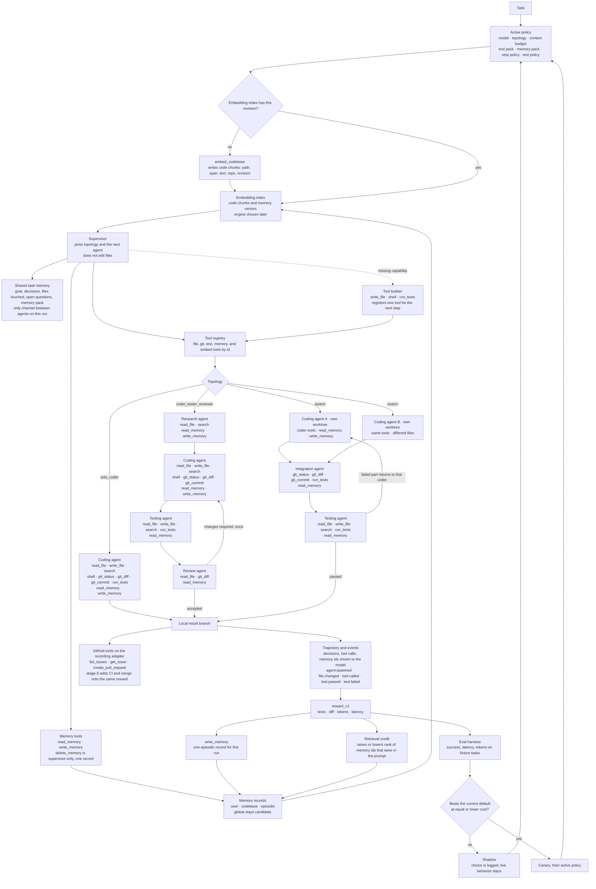

# Tourist — Checkpoints

> Progress board. Tick a box only when that behavior works in the repo, not when it is designed.
> `prd.md` is the design reference (agents, tools, memory, learning). `plan.md` is the older gate write-up. **This file is the build order.** Where it disagrees with `plan.md` on sequence, follow this file.
>
> Last reviewed: 2026-09-29.

## How to read this

The city already turns a public GitHub URL into a village. The next work is the AI, in this order. Nothing in stages 1–7 connects a GitHub account or opens a real pull request. Those functions are stage 8, and they plug into interfaces the AI stages already call.

1. **Tools** — typed functions an agent can call, proven without a model.
2. **Agent** — one coding agent that uses those tools on a local checkout.
3. **Sub-agents** — specialist agents the supervisor can hand work to, one at a time.
4. **Agent swarm** — several coding agents in parallel, then one integration agent.
5. **Entire agent architecture** — one runtime that chooses solo, sub-agents, or swarm.
6. **Memory** — user, codebase, and episodic memory that runtime can retrieve.
7. **Reinforcement learning** — structured policy learning over trajectories. No model-weight training.
8. **GitHub functions** — connect an account, read issues, push, and raise pull requests through the tools from stage 1.

Do not start a stage until the previous stage’s exit box is checked. Through stage 7, repository work happens on a local fixture or a sandbox clone. GitHub tool names may exist as interfaces, and their adapter records the call instead of talking to GitHub.

## Complete system

One top-to-bottom flow. The supervisor reads the active policy, indexes the repo when the revision has no embeddings, loads a memory pack for every agent on the run, then picks solo, sub-agents, or a swarm. After the run, the trajectory is scored and that score is what the next task’s policy is allowed to learn from.

Memory has two stores. The **record store** holds the documents. Its shape is fixed now. The **embedding index** holds vectors for those records and for code chunks. Which vector database runs that index is chosen later. Both stores use the same fields below.

**Memory record:** `id`, `scope` (`user` | `codebase` | `episodic` | `global`), `status` (`candidate` | `active` | `archived`), `repo id` (empty for user scope), `body`, `source trajectory id`, `embedding ref`.

**Code chunk:** `repo id`, `revision`, `path`, `span`, `text`, `embedding ref`.

`read_memory` returns a bounded pack. The supervisor selects that pack once and places it in shared task memory, so research, coding, testing, review, and integration agents on that run see the same memories. `write_memory` appends one record: the supervisor may write user scope, research and coding agents may write codebase scope, and the finished run writes one episodic record. `delete_memory` is supervisor-only and removes one record by id in user, codebase, or episodic scope. Global rows stay `candidate` until a later graduation gate. Agents do not activate them.



---

## Stage 0 — Village from a GitHub URL

**What.** Someone pastes a public GitHub URL (or `owner/repo`) and gets an island of that repository: folders as sectors, files as buildings, landmarks for tests and delivery.

**How.** The landing form parses the URL in `apps/web/lib/github-repo.ts` and routes to `/{owner}/{repo}`. That page calls the public GitHub API with no user token (`apps/web/lib/github-report.ts`), keeps source files, and asks `@tourist/world-generator` for a `CitySnapshot`. `TouristShell` renders it. The same generator serves the local island at `/reports/tourist-city-foundation`.

**Done when.** A public repository URL opens a navigable city of that repo’s default branch.

- [x] World schema exists: sector, district, building, landmark, agent pawn, anchor, `CitySnapshot`, `PublicReport` (`packages/protocol`).
- [x] A repository file list becomes a deterministic layout (`packages/world-generator`).
- [x] The city viewer renders that layout, including inspection of a building.
- [x] The landing page accepts `owner/repo` or a `github.com` URL and opens `/{owner}/{repo}`.
- [x] A **public** repository’s default-branch tree is fetched and drawn as a city.
- [x] The local Tourist repo has a report route with file, test, and pull-request anchors.

Left for later, not part of the AI sequence: private repositories, storing a city so it can be reopened by id, and real line counts instead of the hashed estimate. Private access lands with stage 8. Snapshot storage and real line counts stay deferred city work.

---

## Stage 1 — Tools

**What.** The functions an agent will be allowed to call, defined and tested before any model exists. This is the AI tool layer: read, edit, search, shell, tests, and local git. It is not a GitHub account connection.

**How.** Each tool is a typed function with a JSON manifest: name, description, input schema, output schema, and permissions (`prd.md` §17). A registry lists them (`prd.md` §16) so a later agent can be handed a tool pack by id. A test harness runs the tools against a local fixture repository. No tool takes an arbitrary unsandboxed shell string that can push to a remote. GitHub-facing names (`list_issues`, `create_pull_request`, and the rest in stage 8) are registered now with a **recording adapter**: it checks the arguments and stores the intended call. It does not contact GitHub.

| Tool | Does, in this stage |
| --- | --- |
| `read_file` | Returns a file from the fixture checkout. |
| `write_file` | Writes a file inside the checkout. |
| `search` | Finds text in the checkout. |
| `shell` | Runs an allowlisted command in the checkout (install, test). |
| `run_tests` | Runs the fixture’s test command and returns pass or fail. |
| `git_status` / `git_diff` / `git_commit` | Inspects and commits on a local task branch. |
| `list_issues`, `get_issue`, `create_pull_request` | Same interface the agent will call later. Adapter records the call only. |
| `embed_codebase`, `read_memory`, `write_memory`, `delete_memory` | Names and manifests exist. They return “not available yet” until Stage 6. |

- [x] Tool manifests and a registry exist. A caller can list tools and invoke one by id.
- [x] `read_file`, `write_file`, and `search` work on a local fixture repo.
- [x] `shell` and `run_tests` run only inside that checkout and return structured output.
- [x] Local git tools can create a task branch, show a diff, and commit. They cannot push.
- [x] GitHub tool names are registered and their adapter records a valid call without using the network.
- [x] A new tool can be added by dropping in a manifest plus a function, without changing the agent.
- [x] **Stage 1 exit:** a test script, not a model, edits the fixture, runs tests, commits locally, and records a fake pull-request call.

---

## Stage 2 — Agent

**What.** One coding agent that receives a task and uses the stage 1 tools to change a local checkout. Still no GitHub account and no real pull request.

**How.** The runtime sits behind our own interfaces (`prd.md` §5) so the product is not welded to one SDK:

```text
ModelProvider    = OpenAI, Anthropic, or Gemini, with a task-scoped key
AgentRuntime     = provider-neutral AI SDK tool loop
SandboxProvider  = a local fixture checkout until Daytona is wired
ToolProvider     = the Stage 1 registry
MemoryProvider   = empty until Stage 6
```

Topology is `solo_coder` only. The user submits a task against the fixture. The agent may only act through tools. On success it leaves a local commit and a trajectory of every tool call. The OpenAI key is task-scoped, never logged, and never written into the trajectory (`prd.md` §6).

```text
Task text
    ↓
Solo agent
    ↓
read / search / edit / test / local commit
    ↓
Trajectory (tool calls, diff, test result)
    ↓
Recorded create_pull_request call   # not sent to GitHub
```

- [x] A task can be submitted with an OpenAI key. The key does not return to the browser and does not appear in logs or the trajectory.
- [x] The solo agent solves a fixture task using only registered tools.
- [x] The run ends with a local commit on a task branch and a passing `run_tests` result.
- [x] The trajectory lists each tool call and the test outcome.
- [x] The agent’s pull-request step hits the recording adapter, not GitHub.
- [x] **Stage 2 exit:** one agent, given a fixture task, produces a tested local commit and a complete tool trace.

---

## Stage 3 — Sub-agents

**What.** The supervisor can delegate to specialist agents. They run one after another on the same task. They do not all start at once.

**How.** Specialists from `prd.md` §10, each with its own instructions and a subset of the tool registry:

| Agent | Job |
| --- | --- |
| Supervisor | Breaks the task up and decides the next specialist. Does not edit files. |
| Coding agent | The stage 2 agent. Writes code. |
| Research agent | Reads docs and the repo. Does not write product code. |
| Testing agent | Adds or runs tests. |
| Review agent | Reads the diff and returns required changes. |

They share a **task memory** object (goal, decisions, files touched, open questions). They do not receive each other’s full chat. The provider-neutral runtime performs sequential handoffs. The first allowed chain is coder, then tester, then reviewer. A small task still uses the coder alone. The supervisor chooses; it does not always spawn every specialist (`prd.md` §11).

- [x] Supervisor, research, testing, and review agents exist as separate definitions with separate tool subsets.
- [x] A handoff passes the shared task memory, not the full transcript.
- [x] A fixture bug runs coder → tester → reviewer, and the reviewer can send the coder back once.
- [x] A trivial fixture task runs the coder only, and the trace shows that choice.
- [x] **Stage 3 exit:** one task record shows which sub-agents ran, in order, and the final local commit reflects the reviewer’s accepted diff.

Evidence (2026-09-29): `packages/agent-runtime/test/tools.test.ts` completes the Stage 1 fixture without a model. `solo.test.ts` and `team.test.ts` cover the solo trace, sequential handoff, and one review return. Bounded live OpenAI runs in `solo.live.test.ts` and `team.live.test.ts` each produced a passing fixture commit. Anthropic and Gemini routing is contract-tested but not live-tested without those keys. Local test execution is not an OS sandbox.

Interface work (2026-09-29): `packages/cli` packages the shared runtime as `tourist-agent-cli` with interactive and one-shot run, plan, ask, debug, multi-task, status, model, and memory commands. `apps/api` accepts the same modes and is wired to execute public repositories in disposable Daytona sandboxes, returning patches and a redacted event feed. The landing page embeds a viewer for one cloud run. The npm tarball and local path install ran successfully, a live OpenAI ask command read a disposable fixture, and runtime/API tests plus web build passed. A real Daytona cloud run and browser visual check were not performed. These are interface foundations; Stage 4 swarm integration, Stage 6 Postgres/vector memory, Stage 7 evaluated policy promotion, and Stage 8 GitHub delivery remain unchecked. The local JSON memory store and `reward_v1` logging are functional precursors, not those stage exits.

Interactive terminal check (2026-09-29): the Tourist themed prompt accepted `tourist models` within the session and displayed the configured prices. `/ask What is this repository?` read files in the current uncommitted checkout, showed tool activity, and returned an answer. Coding mode still requires a clean checkout to protect existing work.

Command ribbon check (2026-09-29): the interactive terminal displays a compact horizontal command ribbon. Typing `/` expands the command overview with descriptions; typing filters commands; arrow keys, Tab, and Enter select them. A PTY run selected Plan mode from the ribbon and exited cleanly with Ctrl+C. The ribbon description/filter test passed.

Character suggestion check (2026-09-29): typing `P` in the terminal showed a Plan suggestion and inline completion. Tab filled `/plan`; Enter switched to Plan mode. A normal multiword task returns to the compact ribbon, and the suggestion test passed.

Model picker check (2026-09-29): `models` and `/model` in the interactive terminal open a selectable model table with prices and provider key status. The user can filter by typing, move with arrow keys, adjust supported reasoning levels with left/right, select with Enter, and cancel with Escape. A PTY run selected `gpt-6-luna` and the active header updated. The one-shot `tourist models` remains a printable list.

Model picker refinement (2026-09-29): the 80-column picker displays provider key readiness and reasoning level. A PTY run changed `gpt-6-sol` to low reasoning and the header reflected that selection. `/model <id>` remains a direct shortcut; interactive `models`, `/models`, and `/model` open the picker.

---

## Stage 4 — Agent swarm

**What.** For a task that splits into independent parts, several coding agents work at the same time. One integration agent combines their results.

**How.** The supervisor writes a decomposition into the shared task memory. Each coding agent gets one part and its own worktree or branch inside the sandbox (`prd.md` §10). They do not edit the same files. The integration agent merges those branches, runs tests, and either accepts the result or sends one part back. This topology is opt-in. A single-file change must not start a swarm.

```text
Supervisor
    ↓
Parallel coding agents (separate worktrees)
    ↓
Integration agent
    ↓
Testing agent
    ↓
One local result branch
```

- [ ] Two coding agents can run on disjoint file sets in one sandbox without overwriting each other.
- [ ] The integration agent merges their branches and runs tests.
- [ ] A conflict or a failed test returns that part to the owning coder instead of opening a second swarm.
- [ ] A single-file fixture never starts parallel coders.
- [ ] **Stage 4 exit:** a fixture task with two independent edits finishes as one tested local branch, and the trace shows the parallel agents and the integration step.

---

## Stage 5 — Entire agent architecture

**What.** Stages 1–4 become one system. A single entry point accepts a task and runs the topology that fits: solo agent, sub-agents, or swarm.

**How.** One `AgentRuntime` owns the provider interfaces from stage 2. The supervisor’s only structural choice is the topology (`solo_coder`, `coder_tester_reviewer`, or `swarm`), using the size rules in `prd.md` §11. That choice is written on the run. Every agent reads and writes the same shared task memory. Every tool call goes through the stage 1 registry. If the supervisor decides a capability is missing, a tool-builder step may add a tool: write a manifest, implement it, test it in the sandbox, and register it (`prd.md` §§15–17). The new tool is available on the next step of that run. It is not trusted globally.

Events from the run use the names already sketched for the city (`agent.spawned`, `file.changed`, `tool.called`, `test.passed`, `test.failed`). Delivery events (`branch.pushed`, `pr.created`) stay on the recording adapter.

- [ ] One task entry point can run solo, sub-agents, or swarm, and the run record stores which one ran.
- [ ] Shared task memory is the only channel between agents.
- [ ] The tool builder can register one new tool mid-run, and a later step can call it.
- [ ] A registered tool that fails its own tests is not added to the registry.
- [ ] The run emits agent, file, tool, and test events with no secrets in the payload.
- [ ] **Stage 5 exit:** the same entry point completes a small fixture with one agent and a larger fixture with a swarm, and both runs are inspectable from the trajectory and the event list.

---

## Stage 6 — Memory

Start only after the stage 5 exit is checked. Global memory stays off.

**What.** A later task can reuse how the user likes to work, how this repo is built, and what an earlier run tried. The agent retrieves a few relevant memories. It does not load the whole history.

**How.** Three scopes first (`prd.md` §12). Postgres is the record store and the source of truth. Redis is only hot task state (`prd.md` §13). Vectors for memory records and for code chunks go to an embedding index. The index engine is chosen later. `embed_codebase` fills code chunks for one revision. `read_memory`, `write_memory`, and `delete_memory` are the agent tools from the complete-system diagram. The supervisor puts one memory pack into shared task memory so the other agents on that run read the same notes.

| Scope | Remembers | Written by |
| --- | --- | --- |
| User | How this person likes to work (language, test style, size of change). | Explicit notes, or a sanitizer pass over a finished run. |
| Codebase | Architecture, conventions, fragile areas, prior fixes for one repo. | Notes from finished runs, plus a short index of the fixture. |
| Episodic | One past task: what was tried, what failed, the local result. | The trajectory from stage 5. |

`MemoryProvider` becomes a real retriever: embed the task, fetch a bounded pack of user, codebase, and episodic hits, and pass those ids into the run. The trajectory records which ids were shown to the model. Global memory may be logged as a candidate. Nothing with `scope=global` and `status=active` is readable (`prd.md` §12). Agents cannot promote their own notes.

- [ ] Postgres stores user, codebase, and episodic records with the record shape in the complete-system diagram.
- [ ] `embed_codebase` writes code chunks for one repo revision into the embedding index.
- [ ] `read_memory` returns a bounded pack. Research, coding, testing, review, and integration agents can call it.
- [ ] `write_memory` appends one user record from the supervisor, or one codebase record from a research or coding agent.
- [ ] `delete_memory` removes one user, codebase, or episodic record by id. A call cannot clear a whole scope, and it cannot change a global row.
- [ ] A finished stage 5 run writes an episodic record linked to its trajectory.
- [ ] Codebase memory can store an architecture note and a convention for one repository.
- [ ] User memory can store a preference that applies across that user’s repositories.
- [ ] The runtime retrieves a bounded memory pack instead of the full table.
- [ ] The trajectory lists the memory ids inserted into the prompt.
- [ ] A second task on the same repo uses a note from the first task, and the log shows that id.
- [ ] A test proves an active global row is not returned.
- [ ] **Stage 6 exit:** a second task reuses a stored codebase or episodic note, and the run log shows which note was used.

---

## Stage 7 — Reinforcement learning

Start only after the stage 6 exit is checked. This is not training a new model.

**What.** The supervisor gets better at choosing among a fixed set of decisions: which model class, which topology, how much context, which tool pack, which memory pack, when to stop, which tests to run. Choices that match better scored runs are preferred later.

**How.** Follow `prd.md` §§18–21.

- Do not train foundation-model weights.
- Do not run online PPO against the main model.
- Every completed run already has a trajectory. Add versioned `reward_v1` from signals that exist before GitHub: tests passed, diff produced, tool-builder tool reused, tokens, latency. Pull request, CI, and merge scores are added in stage 8. They are omitted here, not faked.
- The supervisor may only pick from the decision table in `prd.md` §19 (`model`, `topology`, `context_budget`, `tool_pack`, `memory_pack`, `stop_policy`, `test_policy`). `topology` may be `solo_coder`, `coder_tester_reviewer`, or `swarm`. A new decision key needs a protocol change, a default, logging, and an eval.
- A policy version starts in **shadow** (choose and log, do not change behavior), then **canary**, then **active**. Promotion and rollback require the eval harness. Logging is not learning.
- If a stage 6 memory was in the prompt and the run succeeded, that memory can gain retrieval credit. Credit does not turn global memory on.

- [ ] `reward_v1` is stored on every completed trajectory. A completed run with no reward is a bug.
- [ ] Each run logs the decision keys it chose and the policy version that chose them.
- [ ] An eval set of fixture tasks records success, latency, and tokens for solo, sub-agent, and swarm runs.
- [ ] A shadow policy can score those runs without changing what the live supervisor does.
- [ ] A policy cannot become active unless the eval is at least as successful as the current default, at equal or lower cost.
- [ ] Rollback restores the previous policy version without deleting trajectories.
- [ ] **Stage 7 exit:** on the eval set, a promoted policy beats the starting heuristic on success rate or on cost at the same success rate, and every run still has a complete trajectory plus `reward_v1`.

---

## Stage 8 — GitHub account and delivery functions

Start only after the stage 7 exit is checked. This is the first stage that talks to GitHub as the user.

**What.** Connect the user’s GitHub account, then replace the recording adapter with real functions: read issues, push a task branch, open a pull request, and read checks. The agent architecture does not change. Stage 1’s tool names gain a live implementation.

**How.** Use a **GitHub App**, not a personal access token pasted into the browser (`prd.md` §22). Permissions stay limited to metadata, contents, issues, pull requests, and checks on repositories the user selects. The browser starts the install. The server stores the installation id and mints a short-lived token. The token never enters the city snapshot, the trajectory, logs, or the page after the handshake.

The live tools, same ids as stage 1:

| Tool | Does |
| --- | --- |
| `list_issues` | Open issues on the connected repo. |
| `get_issue` | One issue’s body and comments. |
| `list_pull_requests` | Open pull requests. |
| `create_pull_request` | Opens a pull request from the task branch into the default branch. Refuses the default branch as the head. |
| `get_check_runs` | CI status for that branch or pull request. |

Push is allowed only for the task branch, only after the local commit from the agent runtime. `reward_v1` gains the delayed signals that were left out of stage 7: pull request opened, CI finished, merged, reverted. Those updates write onto the same trajectory.

Private `/{owner}/{repo}` cities use the installation token when the viewer has installed the App. Anonymous public URLs keep using the public API.

- [ ] A user can install and disconnect the GitHub App. Installation id and selected repos are stored server-side.
- [ ] The stage 1 GitHub tools call GitHub with an installation token. The recording adapter remains available for tests.
- [ ] A finished agent run pushes its task branch and opens a pull request through `create_pull_request`.
- [ ] The run can list issues and can start from a chosen issue instead of only free text.
- [ ] Check results update the same trajectory’s `reward_v1` when CI finishes.
- [ ] A private repository the user installed opens as a city. A public URL still works with no login.
- [ ] The city lists real pull requests for the connected repo instead of the placeholder cards in `OperationsModal`.
- [ ] **Stage 8 exit:** a connected repo and an issue go through the stage 5 runtime and come back as a real pull request, with the trajectory and reward updated from that pull request.
